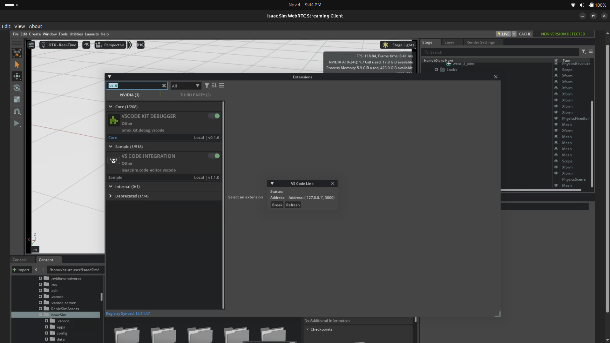
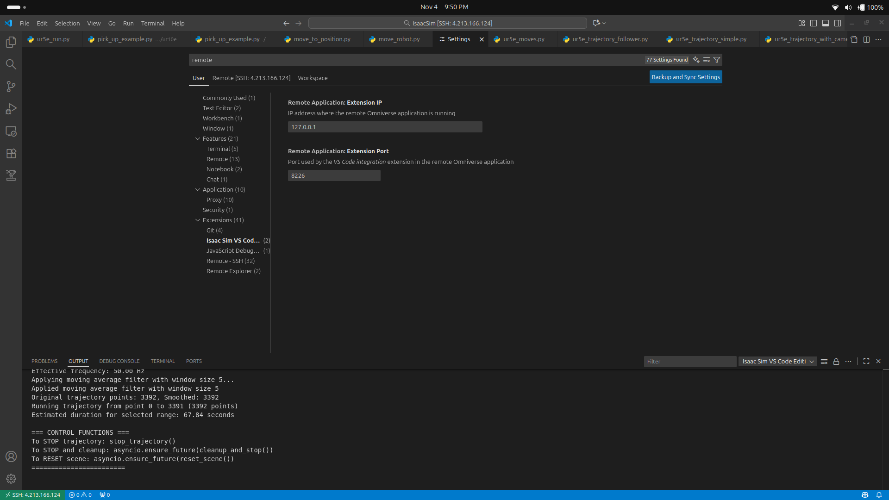
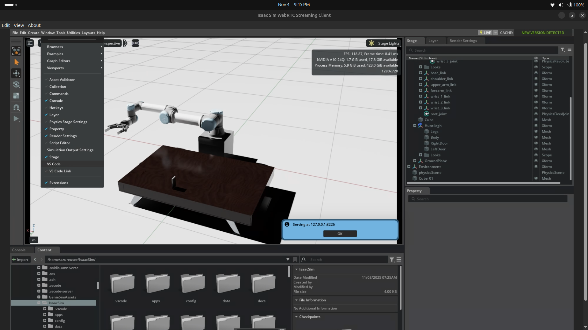

# UR5E Simulation

## Instructions

Follow these quick steps to establish the VS Code <-> Isaac Sim connection.

1. Install and enable the VS Code extension in Isaac Sim. See the extension UI here:

2. Configure the extension settings in VS Code. Open your VS Code settings and set the required fields.

Tip: you can find the connection values from Isaac Sim by going to: Isaac Sim > Windows > VS Code — see the values UI here:

## Trajectory follower scripts (short introductions)

- `Isaac_sim/Trajectory Follower/ur5e_trajectory_follower.py`

  - Loads a recorded UR5e trajectory file, maps gripper values to the robot's gripper range, optionally smooths the data, and executes the joint trajectory inside an Isaac Sim World instance using the robot articulation controller. Provides start/stop/reset helpers and execution progress logging.

- `Isaac_sim/Trajectory Follower/ur5e_trajectory_with_camera.py`
  - Same core trajectory execution as above but additionally creates a camera render product (using Replicator), captures RGB frames from a wrist camera while the robot follows the trajectory, and saves images to disk.

## End effector teleop (python files only)

- `Isaac_sim/End Effector Teleop/bot_spawner.py`

  - Sets up a pick-and-place task and controller for a UR manipulator (adds the task to the world, initializes the PickPlaceController, and runs the simulation loop to apply controller actions, Use Script editor to launch).

- `Isaac_sim/End Effector Teleop/keyboard_teleop.py`
  - Provides an interactive keyboard-driven Cartesian teleop for the UR robot: a background input thread reads W/S/A/D/Q/E for continuous Cartesian moves (and L to stop), computes IK via a kinematics solver, and applies joint actions to move the end-effector.

---
